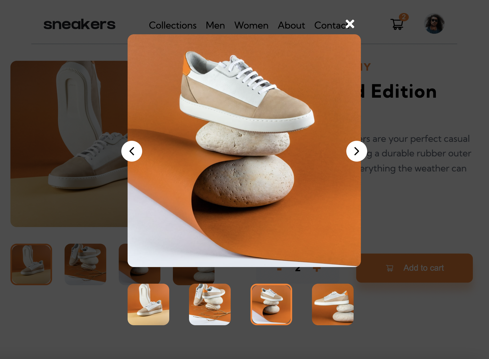

## E-commerce product page // Frontend Mentor Project // React and CSS

- [see project](https://sweta-e-commers-product-page-fm.netlify.app)
- The project is an e-commerce product page where the users should be able to:
  - Use Navbar and toggle Sidebar
  - Open a lightbox gallery by clicking on the large product image
  - Image Slider Carousel on small screen
  - Switch the large product image by clicking on the small thumbnail images
  - Add items to the cart
  - View the cart and remove items from it; Update shopping cart on LocalStorage.

    

 

    

 

    

 

    

 

#### Comments about the code

#### Helpers

- for the slider on the small page: https://www.youtube.com/watch?v=l1MYfu5YWHc
